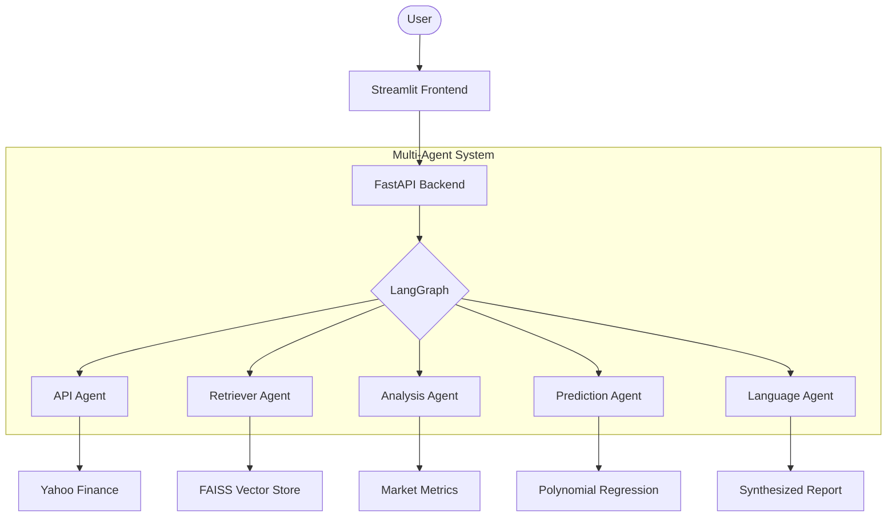

# 🤖 Multi-Agent Financial Assistant

[](https://www.python.org/downloads/)
[](https://streamlit.io/)
[](https://fastapi.tiangolo.com/)
[](https://github.com/langchain-ai/langgraph)

A high-performance, multi-agent financial analysis platform. This system leverages specialized AI agents to provide deep market insights, technical analysis, and price forecasting through an interactive dashboard.

---

## 🏗️ Architecture Overview

The system operates on a **Research -> Analysis -> Synthesis** workflow coordinated by **LangGraph**.



---

## 🌟 Features

- **Multi-Agent Orchestration**: Seamless coordination between 5 specialized agents.
- **Dynamic Stock Discovery**: Searchable dropdown featuring the full **S&P 500** list fetched in real-time.
- **Predictive Modeling**: Short-term trend forecasting using **Polynomial Regression**.
- **Contextual Intelligence**: RAG-based retrieval via **FAISS** for deep financial context.
- **Blazing Fast**: Optimized with an **In-Memory Caching** system (No external Redis required).
- **Interactive Visualizations**: Dynamic price trend charts powered by **Plotly**.

---

## 🛠️ Tech Stack

- **Frameworks**: LangGraph, LangChain, FastAPI, Streamlit.
- **Data & Storage**: YFinance, FAISS, Pandas.
- **ML & Analysis**: Scikit-learn, Numpy.
- **DevOps**: Docker, Docker Compose, GitHub Actions.

---

## 🚀 Getting Started

### 1. Project Setup
```bash
# Clone the repository
git clone https://github.com/Shivam1026/Multi-agent-Finance-Assistant.git
cd Multi-agent-Finance-Assistant

# Create and activate virtual environment
python -m venv .venv
source .venv/bin/activate  # On Windows: .venv\Scripts\activate

# Install dependencies
pip install -r finance_app/requirements.txt
```

### 2. Configuration
The system uses the following model configuration in your `.env` file:

```env
MODEL_NAME=gpt-4-turbo-preview
```

### 3. Execution
The application requires running the backend and frontend services concurrently.

**Start Backend (FastAPI):**
```bash
uvicorn finance_app.api.routes:app --host 127.0.0.1 --port 8000
```

**Start Frontend (Streamlit):**
```bash
streamlit run finance_app/app.py
```

---

## 📦 Docker Deployment

Run the entire stack with a single command using Docker Compose:

```bash
docker-compose up --build
```

---

## 📁 Project Structure

```text
finance_app/
├── agents/             # Logic for specialized AI agents
├── api/                # FastAPI endpoint definitions
├── data_layer/         # YFinance, FAISS, and In-memory Caching
├── models/             # Polynomial Regression implementation
├── orchestrator/       # LangGraph state and workflow logic
├── utils/              # Helper functions and cache management
└── app.py              # Streamlit dashboard
```

---
**Developed by Shivam Mishra**
